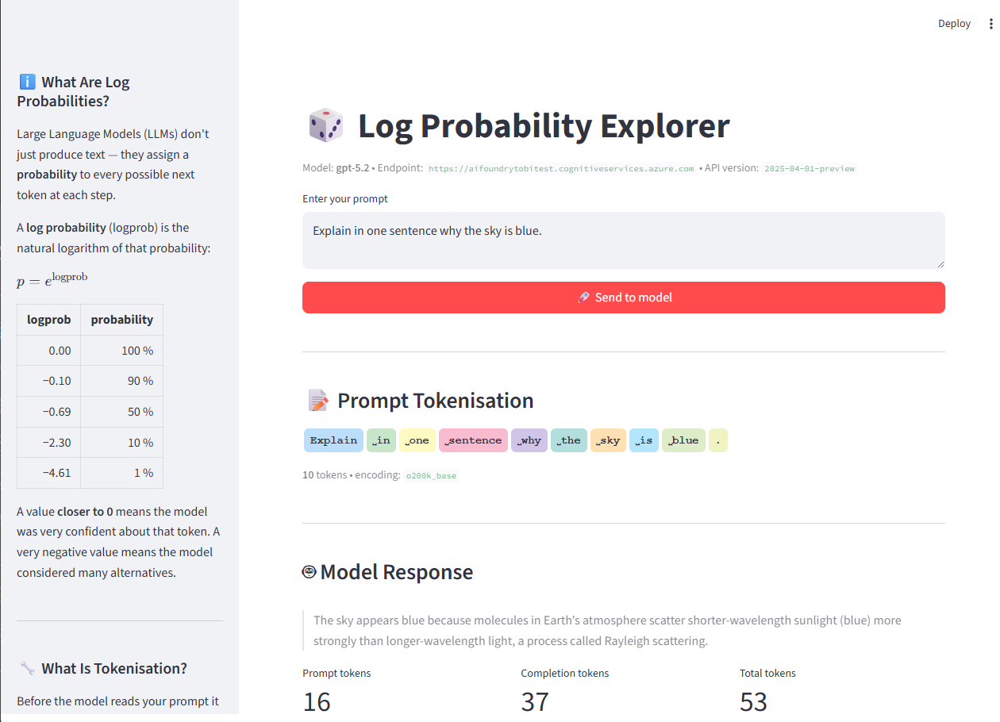
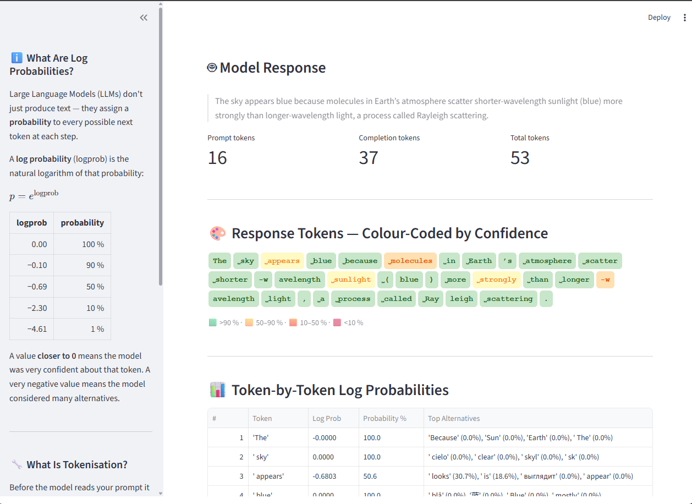
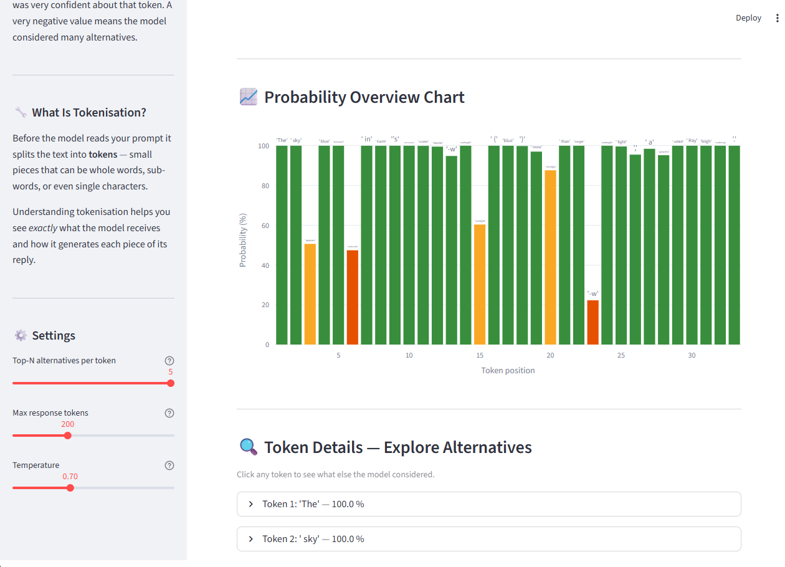

# 🎲 Log Probability Explorer

An interactive Streamlit app that visualises **token-level log probabilities** from Azure OpenAI (Azure AI Foundry).  
Built as an educational tool to help explain how Large Language Models generate text.

## What It Does

1. **Tokenises your prompt** — shows exactly how the model splits your text into tokens, displayed as coloured badges.
2. **Sends the prompt** to an Azure-hosted model (e.g. GPT-5.2) via the Chat Completions API with `logprobs` enabled.
3. **Displays the response** token-by-token with:
   - Colour-coded confidence badges (green → red)
   - A sortable data table with log probs, percentages, and top alternatives
   - An interactive Plotly bar chart of probabilities across the full response
   - Per-token expanders showing what other tokens the model considered

## Quick Start

### Prerequisites

- Python 3.10+
- An Azure AI Foundry / Azure OpenAI resource with a deployed chat model

### 1. Clone & install

```bash
cd LogProp
pip install -r requirements.txt
```

### 2. Configure `.env`

Create (or edit) a `.env` file in the project root:

```dotenv
OPENAI_API_KEY=<your-azure-openai-key>
AZURE_OPENAI_ENDPOINT=https://<your-resource>.cognitiveservices.azure.com
API_VERSION=2025-04-01-preview
LOGPROB_MODEL=gpt-5.2
```

> **Note:** The endpoint should be the *base* URL of your Azure Cognitive Services resource — the SDK builds the full Chat Completions path automatically.

### 3. Run

```bash
streamlit run logprob_demo.py
```

The app opens in your browser at `http://localhost:8501`.

## Understanding the Output

| Colour | Probability | Meaning |
|--------|------------|---------|
| 🟩 Green  | > 90 % | Model was very confident |
| 🟨 Yellow | 50 – 90 % | Fairly confident |
| 🟧 Orange | 10 – 50 % | Multiple plausible options |
| 🟥 Red    | < 10 % | Low confidence / surprising choice |

### Log Probabilities — Quick Primer

A **log probability** is the natural logarithm of the model's predicted probability for a token:

```
probability = e^(logprob)
```

- `logprob = 0.00` → 100 % confidence
- `logprob = −0.69` → ~50 %
- `logprob = −2.30` → ~10 %

The closer to zero, the more certain the model was.

## Project Structure

```
LogProp/
├── .env                 # Azure credentials (not committed)
├── logprob_demo.py      # Streamlit application
├── requirements.txt     # Python dependencies
└── README.md            # This file
```

## Tech Stack

- **[Streamlit](https://streamlit.io/)** — Web UI
- **[OpenAI Python SDK](https://github.com/openai/openai-python)** — Azure OpenAI client (`AzureOpenAI`)
- **[tiktoken](https://github.com/openai/tiktoken)** — BPE tokeniser for prompt visualisation
- **[Plotly](https://plotly.com/python/)** — Interactive charts
- **[python-dotenv](https://github.com/theskumar/python-dotenv)** — `.env` file loading

## Screenshots






